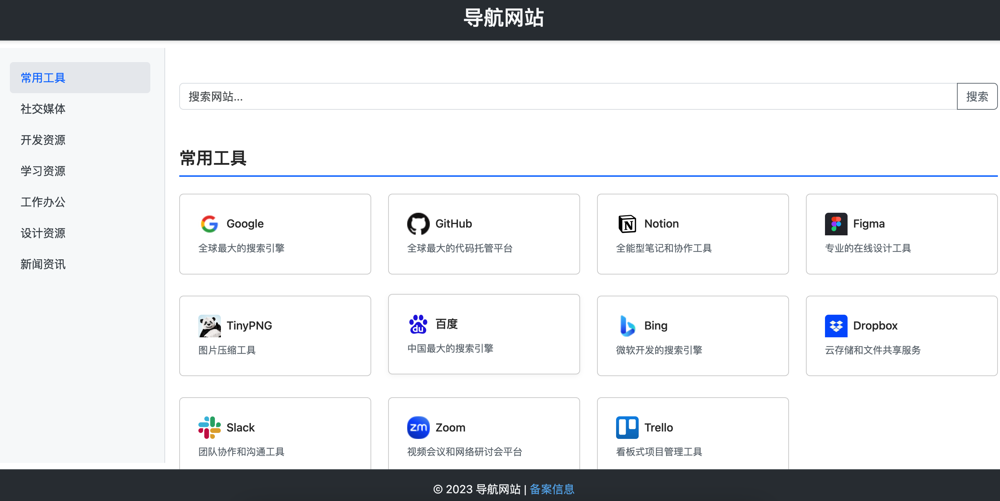

# Simple Navi

## 项目介绍
这是一个基于现代Web技术构建的导航网站项目，提供常用网站的分类导航功能。项目采用响应式设计，适配PC和移动端多种设备，为用户提供简洁美观的浏览体验。

## 功能特性
- 响应式设计，适配PC和移动端多种设备
- 智能分类展示常用网站，支持自定义分类
- 快速搜索功能，支持模糊匹配
- 支持用户收藏常用网站

## 技术栈
- 前端框架: Bootstrap 5
- JavaScript库: jQuery 3.6

## 开发环境配置
1. 推荐使用 VS Code 作为开发工具
2. 直接打开 index.html 文件或者将项目部署到服务器上

## 使用说明
1. 克隆本项目: `git clone https://github.com/ybcjcc/simple-navi.git`
2. 修改 data.js 文件中的数据，添加或修改网站信息
3. 直接打开 index.html 

## 部署说明
1. 将项目部署到服务器上
2. 配置服务器环境，确保支持 HTML5 和 CSS3
3. 访问项目地址即可 

## 贡献指南
1. Fork 本项目
2. 创建新分支 (`git checkout -b feature/xxx`)
3. 提交修改 (`git commit -am 'Add some feature'`)
4. 推送分支 (`git push origin feature/xxx`)
5. 创建 Pull Request

## 截图展示
### 网页端

### 移动端

## 许可证
MIT